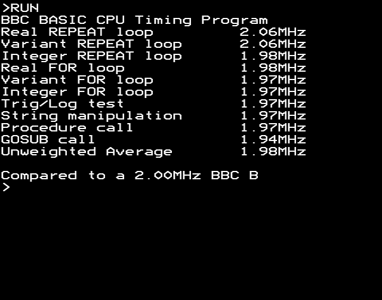

# Run BBC Basic

### What?

Run BBC Basic on Linux, or probably any POSIX system.

### How?

This is a small 6502 emulator that runs the BBC HiBasic 3.10 ROM, and a tiny 256 byte OS from 0xff00-0xffff to bootstrap the emulated machine.
Whenever BBC Basic does a MOS call, it is intercepted by the emulation loop, and its functionality is replicated in C code, after which it returns to Basic.
It's **NOT** a BBC emulator!

### What works?

Except for the graphics related functions and VDU in general, everything sort of works.
Even TIME works, so you can compare its speed to real hardware.
Star commands are passed to the shell, so you can do ```*ls```.
All paths can be standard host paths, like ```LOAD "test/FIBO.BAS"```.

### Escape?

Keyboard input is handled on a line-by-line basis (utilizing getline()) and there is no keyboard polling loop running in the background.
This means that Escape does not work like you might be used to on a real BBC.
To interrupt a running program, press CTRL-C, and type ```OLD``` to get your program back.
To exit Basic all together, press CTRL-Z.
Note that INKEY **does** use a raw keyboard polling routine, so pressing Escape when the program expects a single keypress works.

### Why?

This was mostly written to examine what minimal MOS functionality one needs to implement to get a mostly fully working BBC Basic, and how.
I wanted to know this before starting a port in assembly on a new machine.

### Build instructions?

Clone git repo, cd into it, and type ```make```. You shouldn't need anything beyond a C compiler and its standard libary.
On Windows, you might need to use cygwin. MSYS2 will probably not work, because it's missing getline().
On macOS, any XCode should work. This has not been tested yet.

### Free memory?

```
>@%=&20108:PRINT (HIMEM-LOMEM)/1024;" kB"
    44.0 kB
```

### Speed?

Ran on an AMD FX-8320 Eight-Core Processor (released October 2012), on a single core at 3.5GHz.

```
$ ./runbasic 

BASIC
>LOAD "test/CLOCKSP.BAS"
>RUN
BBC BASIC CPU Timing Program
Real REPEAT loop       188.49MHz
Variant REPEAT loop    186.84MHz
Integer REPEAT loop    192.00MHz
Real FOR loop          197.68MHz
Variant FOR loop       197.67MHz
Integer FOR loop       218.89MHz
Trig/Log test          222.00MHz
String manipulation    234.67MHz
Procedure call         192.56MHz
GOSUB call             216.28MHz
Unweighted Average     204.70MHz

Compared to a 2.00MHz BBC B
>
```

The same on b-em, Model B 32K:



### Credits

Copyright © 2025 by Ivo van Poorten, licensed under the BSD 2-Clause License.  
BBC Basic 3.10 is Copyright © 1983 by Acornsoft.
